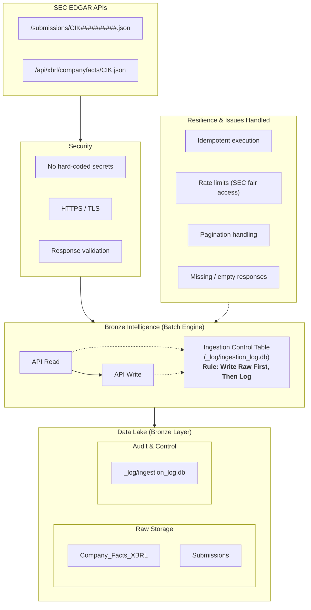

# SEC EDGAR Medallion Data Pipeline

An end-to-end Data Engineering pipeline built around the **SEC EDGAR APIs**, designed following the **Medallion Architecture** (Bronze, Silver, Gold). 

The pipeline is currently being developed and validated locally in **Python** using **batch processing**, with the goal of making it simple to "lift and shift" directly into **Microsoft Fabric** as an analytical SaaS platform.

> 📌 **Note — Iterative Architecture (Version 1):**  
> This project is in its early stages. The current architecture represents **Version 1**, focused on batch processing. System designs, schemas, and architectural choices may change and evolve as new requirements and optimizations arise.

---

## 🗺️ Project Roadmap & Status

This project is implemented incrementally across distinct phases. Each layer will receive its own dedicated documentation as design decisions evolve:

| Layer / Component | Description | Processing Mode | Status |
| :--- | :--- | :--- | :--- |
| **Bronze Layer** | Ingestion of raw SEC EDGAR data with control logging and rate limiting | Batch (v1) | 🟡 **Active Implementation** (Blueprint v1 ready) |
| **Silver Layer** | Transformation, cleaning, and normalization | TBD | ⚪ *TBD / Incoming (Details to be determined)* |
| **Gold Layer** | Curated data modeling to answer business stakeholder questions | TBD | ⚪ *TBD / Incoming (Details to be determined)* |
| **Reporting (Power BI)** | Interactive dashboard answering key business questions | — | ⚪ *TBD / Incoming (Details to be determined)* |

---

## 🏛️ Bronze Layer Architecture (Version 1 — Batch Processing)

The Bronze Layer safely acquires raw data from the SEC EDGAR APIs via scheduled batch runs and lands it in raw format before downstream transformations occur.

> 💡 **Tip:**  
> This blueprint represents **Version 1** of the batch ingestion design and may be revised as testing and development progress.



### Key Architectural Pillars:

1. **Source APIs**:
   - `submissions/CIK##########.json`: Company submission metadata and filing history.
   - `api/xbrl/companyfacts/CIK.json`: Structured XBRL company facts and disclosure data.

2. **Security & Standards**:
   - Strict prevention of hard-coded credentials or personal headers.
   - Secure HTTPS/TLS communication.
   - Response validation prior to ingestion.

3. **Bronze Intelligence & Execution Logic**:
   - **`API Read` & `API Write`**: Decoupled read and write operations designed for batch execution.
   - **"Write Raw First, Then Log" Pattern**: Data is committed to raw storage before recording state in the control table, preventing orphan logs in case of failure.

4. **Resilience & Edge Cases Handled**:
   - **Rate Limiting**: Throttles calls to comply with SEC fair access regulations (e.g., max 10 requests/sec).
   - **Idempotency**: Batch re-runs will not duplicate or corrupt landing data.
   - **Pagination**: Gracefully traverses multi-part responses.
   - **Empty/Missing Data**: Resilient handling of invalid CIKs or empty JSON payloads.

5. **Data Lake Storage Layout**:
   - `Bronze_layer/Raw storage/Company_Facts_XBRL/`
   - `Bronze_layer/Raw storage/Submissions/`
   - `Bronze_layer/Ingestion Control Tables/_log/ingestion_log.db`

---

## 📂 Project Directory Structure

```text
FabricDataEngineer/
├── Publish/
│   └── Code/
│       ├── Bronze_Layer/          # Raw batch ingestion logic
│       │   ├── Api_Read.py        # API requests & resilience
│       │   └── Api_Rate_Limiter.py # SEC throttling & backoff
│       ├── Silver_Layer/          # (Incoming) Transformations & cleaning
│       ├── Gold_Layer/            # (Incoming) Curated business models
│       └── Tests/                 # Comprehensive test suite per layer
│           ├── Bronze_Test/       # Unit tests for Bronze Layer classes
│           │   └── conftest.py    # Test fixtures & mocks
│           ├── Silver_Test/       # (Incoming) Tests for Silver Layer
│           └── Gold_Test/         # (Incoming) Tests for Gold Layer
├── .gitignore
└── README.md
```

---

## 🧪 Testing Strategy

To guarantee reliability, maintainability, and safe refactoring as we scale toward Microsoft Fabric:
- **Class-Level Unit Testing**: Every Python class created across each layer will have a corresponding test suite located under `Publish/Code/Tests/`.
- **Mocking & Fixtures**: Network calls (e.g., SEC EDGAR endpoints) and local file I/O are isolated using fixtures and `conftest.py` to ensure fast, idempotent test runs without hitting live SEC rate limits.
- **Incremental Expansion**: As the Silver and Gold layers are developed, their respective test suites (`Silver_Test/`, `Gold_Test/`) will be introduced alongside them.

---

## 🧰 Technology Stack

- **Python**: Primary language for batch ingestion, throttling, logging, and tests.
  *(Additional libraries and dependencies will be documented as the implementation progresses).*

---

## ⚙️ Prerequisites & Setup

> ⚠️ **Status: In Progress**  
> Environment setup instructions and dependencies are currently being finalized alongside the Bronze Layer release.